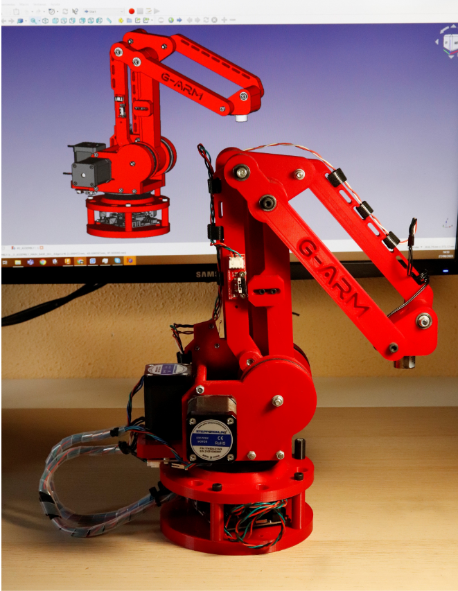

# G-Arm
This is the official repo of a full open source 3D printed robotic arm called G-Arm.

You can see some demos in this [Youtube channel](https://www.youtube.com/@mrvaidel4999/featured) [](https://www.youtube.com/).     

  

# How to make it?
1. Generate all the **.stl** files from the source files in FreeCAD. Then print them with the recommended densities shown [here](https://github.com/vidalperezbohoyo/g-arm/wiki/List-of-3D-printed-parts).
2. Buy all the necessary parts (or other equivalent) listed [here](https://github.com/vidalperezbohoyo/g-arm/wiki/List-of-purchasable-parts).
3. Assemble the entire robot based on the [assembly file](https://github.com/vidalperezbohoyo/g-arm/blob/main/hardware/FreeCad/%230_ASSEMBLY.FCStd).
4. Connect the electronics as [this](https://github.com/vidalperezbohoyo/g-arm/wiki/Electronic-diagram) diagram.
5. Cross your fingers 🤞 and install the software shown below.

# Software to control it
1. Currently, it uses [**GRBL**](https://github.com/bdring/Grbl_Esp32) as the integrated firmware in the robot's base. The required GRBL configuration can be found [here](https://github.com/vidalperezbohoyo/g-arm/blob/main/documentation/GRBL_config.txt).
2. It is recommended to control it at a high level using ROS 2 and MoveIt2. For that, you have to install [**ROS 2 Humble**](https://docs.ros.org/en/humble/Installation/Ubuntu-Install-Debians.html) and [**MoveIt 2**](https://moveit.ros.org/install-moveit2/binary/). Also, you have to copy
the ROS 2 packages created for this robot into your ROS 2 workspace (and source them correctly). On top of that, you have the [**PyMoveit API**](https://github.com/AndrejOrsula/pymoveit2) installed.
3. If you don't want to use via ROS 2, you can use the Python classes from [this folder](https://github.com/vidalperezbohoyo/g-arm/tree/main/ros2/g_arm/g_arm/g_arm_lib) to control the robot at middle level (not recommended).

# How to launch the software
You have to run first the G-Arm **ROS 2 driver** with:
```
ros2 run g_arm driver.py
```
In other terminal, you have to launch the G-Arm **MoveIt2 launcher**:
```
ros2 run g_arm_moveit2 demo.launch.py
```
If all has been launched correctly, now you can control the arm via **Rviz Moveit UI plugin**.  
  
Furthermore, you can control the arm by code inside the MoveIt framework. The ```g_arm_python_examples``` package contains some examples in Python to 
make trajectories and taking objects with the electromagnet. Them are detailed in the [wiki](https://github.com/vidalperezbohoyo/g-arm/wiki/MoveIt-Examples).

